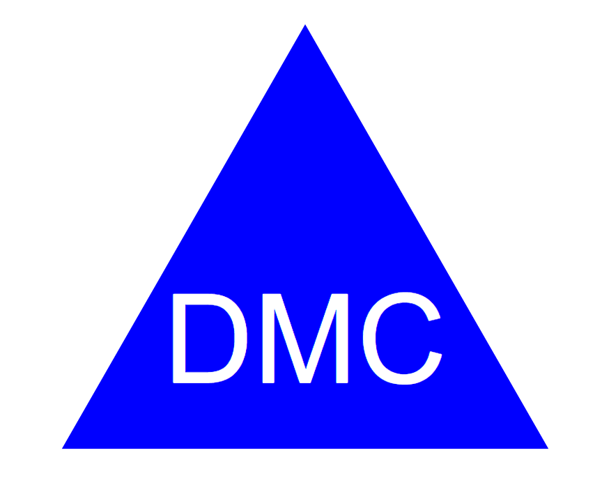

# SVG Logo Maker

SVG logo Maker allows a user to create a logo with a shape, and 3 letters. You can choose between 3 shapes, and choose any color for the
text and the shape.

## Features

* Creates SVG based on user input.
* Pick any color
* Pick a shape between square, triangle, or circle

## Getting Started
To set up SVG_Logo_Maker on your local machine, follow these instructions:

* Clone the repository.
* Install the required dependencies(Inquirer, jest)
* Activate by using command line using node index.js

## Technologies Used 
* Node.js
* JavaScript
* Inquirer 
* Jest 

##  Links

[Git Hub](https://github.com/Daniel-Covington/SVG_Logo_Maker)

## Preview

The following image demonstrates the web application's appearance and functionality:

